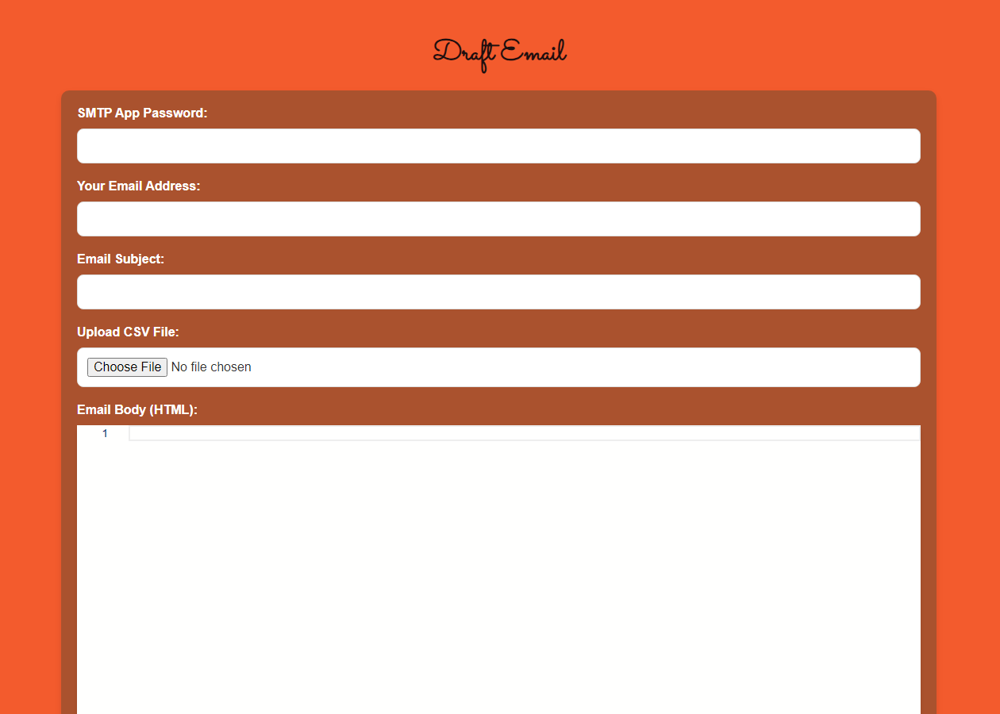
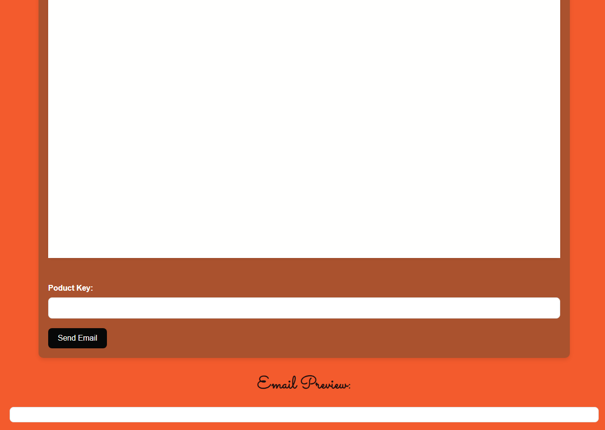

# SendWise_EmailDrafter
it is a simple python flask web app that helps users draft, build and visualize html emails 

initialy this is how the webpage looks
#SendWise

the when drafting and email the email preview changes to display the new draft as it is being build

#While Drafting

